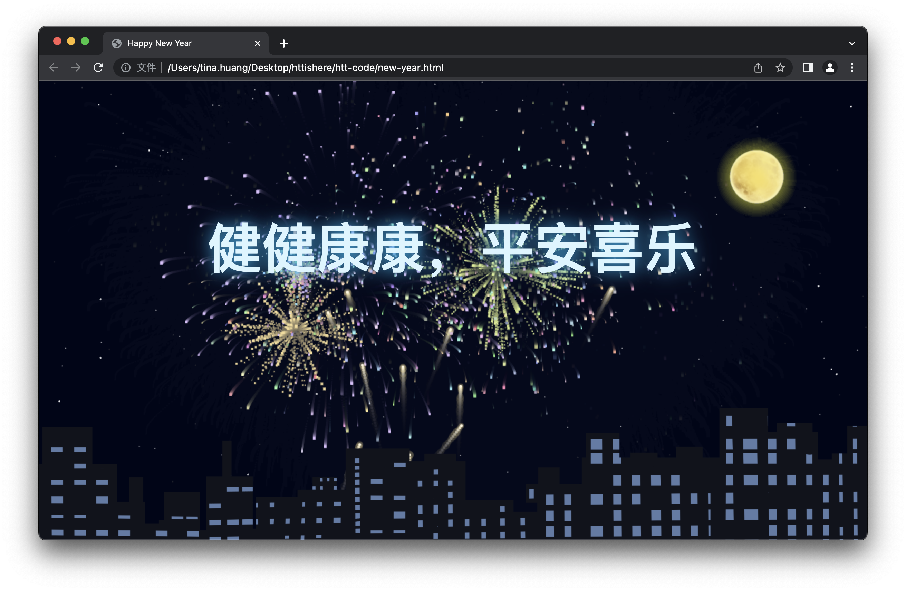

# 代码分享（<strong style="color:red;">⚠️ 请仔细看下方说明</strong>）

## <strong style="color:red;">!!</strong> 下载代码


## 教程视频请看👀 ⬇️ ⬇️
### http://music.ztxs.gq个人网站
---

## 🎆 新年祝福代码（fireworks.html)


### 使用方法

- 搜索**Happy New Year**部分，对该部分文字进行修改(可替换或删除)
  ```js
  let myLabels = [
      "Happy New Year",
  ];
  ```
- 修改音乐，替换下面代码的链接部分
  ```js
  let music_url = "http://music.163.com/song/media/outer/url?id=1892513656.mp3";
  ```

